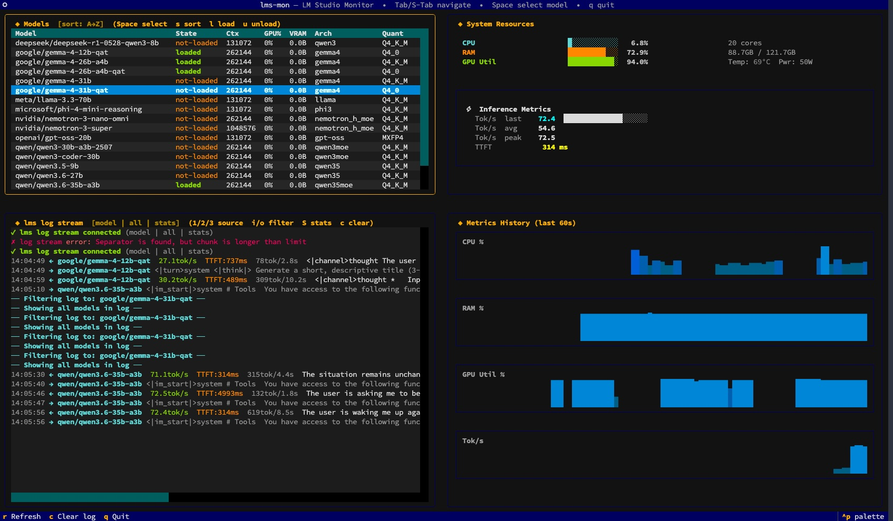

# lms-mon

> **TUI monitor for [LM Studio](https://lmstudio.ai)**

Real-time visibility into loaded models, inference traces, GPU/CPU/RAM usage,
and rolling sparkline graphs — all in a single terminal window.



---

## Features

- **4-pane layout** — models table, system meters, live log, sparkline graphs
- **Tab / Shift-Tab** to cycle panes; active pane gets an accent border
- **↑ / ↓** to select a model row → highlights that model’s traces in the log pane
- Live inference stats: tok/s (last / avg / peak), TTFT, request count
- GPU metrics via `nvidia-smi` (NVIDIA); gracefully skipped if absent
- `lms log stream --json --stats` parsed in real time — exact prompt/response traces
- Shows helpful error if `lms` is not on `PATH`

---

## Requirements


| Dependency                                       | Version  | Purpose                          |
| ------------------------------------------------ | -------- | -------------------------------- |
| Python                                           | ≥ 3.10   | Runtime                          |
| [textual](https://github.com/Textualize/textual) | ≥ 0.70   | TUI framework                    |
| [httpx](https://www.python-httpx.org/)           | ≥ 0.27   | Async HTTP to LM Studio REST API |
| [psutil](https://github.com/giampaolo/psutil)    | ≥ 5.9    | CPU / RAM metrics                |
| LM Studio                                        | ≥ 0.3.26 | `lms` CLI + REST API             |
| nvidia-smi                                       | optional | GPU metrics (NVIDIA only)        |


---

## Install

### Option A — uv (recommended)

[uv](https://docs.astral.sh/uv/) provides the fastest isolated Python 3.12 environment.

```bash
# 1. install uv if not already present
curl -LsSf https://astral.sh/uv/install.sh | sh

# 2. clone
git clone https://github.com/dcolley/lms-mon.git
cd lms-mon

# 3. create venv with Python 3.12 and install deps
uv venv --python=3.12
source .venv/bin/activate          # Windows: .venv\Scripts\activate
uv pip install -r requirements.txt

# 4. run
python lms_mon.py
```

Or install as an editable CLI entry-point:

```bash
uv pip install -e .
lms-mon
```

### Option B — pip + venv

```bash
git clone https://github.com/dcolley/lms-mon.git
cd lms-mon
python3.12 -m venv .venv
source .venv/bin/activate
pip install -r requirements.txt
python lms_mon.py
```

### Option C — pipx (isolated global command)

```bash
pipx install git+https://github.com/dcolley/lms-mon.git
lms-mon
```

---

## LM Studio setup

```bash
# Ensure lms CLI is on PATH (one-time bootstrap)
~/.lmstudio/bin/lms bootstrap

# Start the server if not running
lms server start

# Verify
lms ps
lms server status
```

`lms-mon` uses:

- `GET http://localhost:1234/api/v0/models` — models pane
- `lms log stream --source model --filter input,output --json --stats` — log pane

---

## Usage

```bash
lms-mon                            # default localhost:1234
lms-mon --host 192.168.1.100       # remote LM Studio instance
lms-mon --port 8080                # custom port
```

### Keyboard shortcuts


| Key         | Action                                                 |
| ----------- | ------------------------------------------------------ |
| `Tab`       | Focus next pane                                        |
| `Shift+Tab` | Focus previous pane                                    |
| `↑` / `↓`   | Move model cursor (log pane highlights selected model) |
| `r`         | Force-refresh model list                               |
| `c`         | Clear log pane                                         |
| `q`         | Quit                                                   |


---

## GPU support


| Backend             | Status         | Notes                                                                        |
| ------------------- | -------------- | ---------------------------------------------------------------------------- |
| **NVIDIA**          | ✅ automatic    | Requires `nvidia-smi` on `PATH`                                              |
| **AMD ROCm**        | ⚙ patch needed | Swap `nvidia-smi` call for `rocm-smi --showuse --csv` in `_try_nvidia_smi()` |
| **Apple Silicon**   | ⚙ patch needed | Use `powermetrics` (requires `sudo`)                                         |
| **None / CPU-only** | ✅ graceful     | GPU row hidden; everything else works normally                               |


---

## Project structure

```
lms-mon/
├── lms_mon.py        ← single-file app (all TUI logic)
├── requirements.txt  ← pinned runtime deps for uv/pip
├── pyproject.toml    ← PEP 517 build metadata + entry-point
├── setup.cfg         ← legacy setuptools fallback
├── LICENSE           ← MIT
├── .gitignore
└── README.md
```

---

## Contributing

PRs welcome. Obvious extensions:

- AMD ROCm / Apple Silicon GPU polling
- `/api/v0/models/{id}/stats` per-model VRAM breakdown
- Export inference traces to JSONL
- Prometheus metrics exporter mode (`--prometheus-port`)

---

## License

MIT © 2026 dcolley